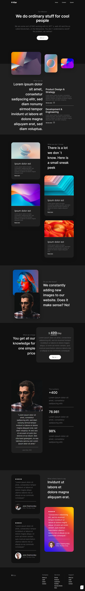
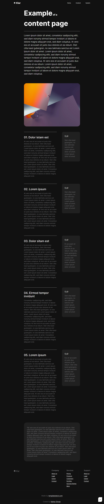
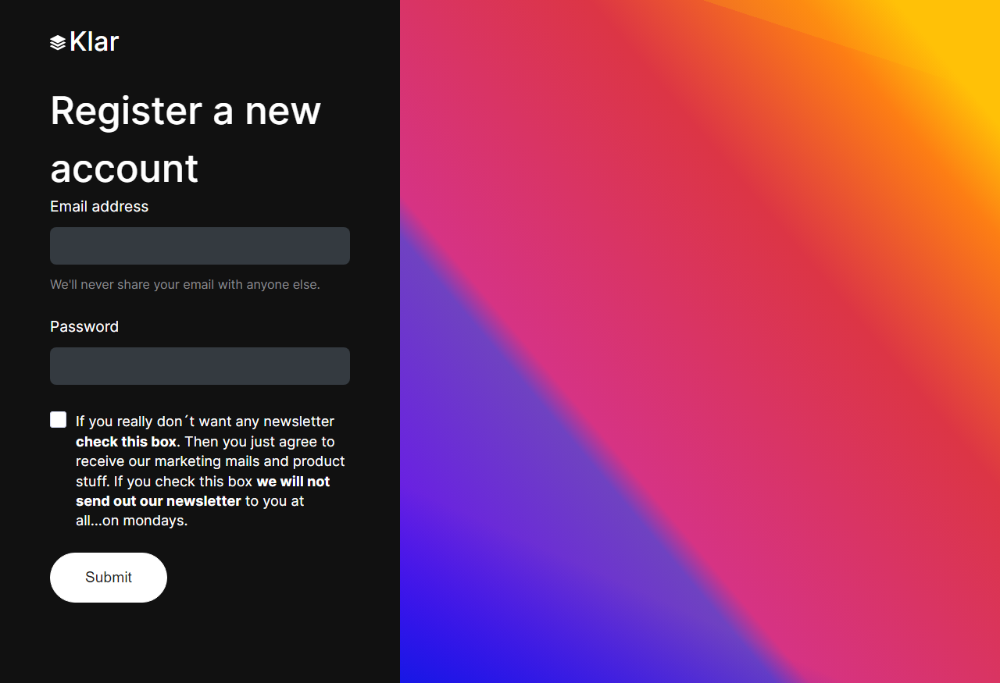

# 🏠 Klar | Landing Page

A clean and responsive landing page built using HTML, Sass, and JavaScript.  
This is my **first project**, created step by step by following video lessons.  

🗓️ **Project created on:** ‎Sunday, ‎November ‎19, ‎2023.  

This project is inspired by the original design by **Holger**.

---

## 📸 Screenshots

### 🖥️ Home Screen  


### 🖥️ About Screen  


### 🖥️ System Screen  


---

## 🛠️ Built With

- HTML5
- Sass (SCSS)
- JavaScript (Vanilla JS)
- Responsive Design (Media Queries)
- Google Fonts – [Inter](https://fonts.google.com/specimen/Inter)
- Font Awesome Icons

---

## 📂 Folder Structure

```

Klar-Landing-Page/
├── images/
│   ├── webp/
│   │   └── favicon-32x32.webp
│   └── ...
├── Css/
│   ├── style.css
│   ├── content.css
│   └── system.css
├── Sass/
│   ├── style.scss
│   ├── content.scss
│   ├── system.scss
│   ├── \_globalStyle.scss
│   ├── \_breakpoints.scss
│   ├── \_Custom-Scrollbars-&-Selection-color.scss
│   └── \_containerScreen.scss
├── JavaScript/
│   └── script.js
├── html/
│   ├── content.html
│   └── system.html
├── index.html
├── design/
│   ├── screencapture-Template-klar-Home.png
│   ├── screencapture-Template-klar-About.png
│   └── screencapture-Template-klarl-system.png
└── README.md

```

---

## 📋 Features

- 🎯 Clean and modern layout  
- 🌀 Smooth scroll reveal animations for sections  
- 📱 Fully responsive across desktop, tablet, and mobile  
- ⬆️ Back to top button with smooth scroll functionality  
- ⚙️ Mobile menu toggle with overlay effect  
- 💡 Practiced **HTML, Sass, JavaScript**, and responsive design techniques

---

## 🚀 Live Demo

🔗 [View Live Project](https://maher-elmair.github.io/Klar/)

---

## 📚 Useful Links

Original template and Figma reference by **Holger**:  

- [Klar HTML Template](https://templatedeck.com/klar-html-template.html)  
- [Holger GitHub](https://github.com/holger1411)

---

## 🧑‍💻 Author

**Maher Elmair**

- 📫 [maher.elmair.dev@gmail.com](mailto:maher.elmair.dev@gmail.com)
- 🔗 [LinkedIn](https://www.linkedin.com/in/maher-elmair-831042237)
- ❤️ Made with passion by [Maher Elmair](https://maher-elmair.github.io/My_Website)

---

## 🙏 Acknowledgments

- 🎨 Design inspired by the original template by **Holger**  
- 🎓 This is my **first project**, created step by step by following video lessons  
- 💡 This project helped me practice **HTML, Sass, JavaScript**, and responsive design techniques

---